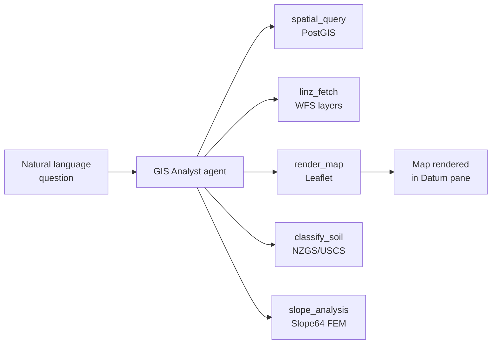
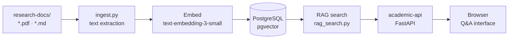
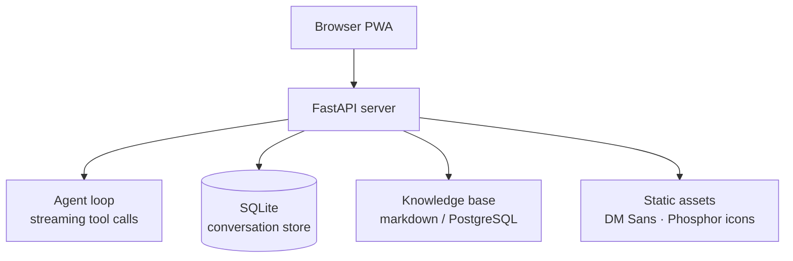

# Datum Assistants

A collection of domain-specific AI assistants built on the Datum platform. Each is a standalone deployable with its own knowledge base, tool set, and UI branding — all sharing a common FastAPI + streaming architecture.

---

## What this is

Not every AI assistant deployment needs the full Datum platform. Sometimes the requirement is a focused tool for a specific domain — one that a non-technical user can open in a browser, ask a question, and get a useful answer without needing to understand personas, pane layouts, or session routing.

The Datum Assistants are exactly that: purpose-built, single-domain tools that deploy as self-contained Docker containers and do one thing well. A geotechnical engineer needs to analyse spatial data and interpret soil classifications — not manage conversations across six personas. A CEO needs briefings and drafts of communications — not a developer-oriented code pane. An academic needs to query a PDF corpus — not a multi-tool research pipeline.

Each assistant in this collection was built for a real deployment. The GIS Analyst was built for consulting work requiring daily spatial queries. The CEO Copilot was deployed for a client organisation. The Academic Assistant emerged from research workflows that needed something better than keyword search over a growing PDF library. The Slope64 Chatbot makes a specialist engineering program accessible without requiring the user to understand its input format. All of them share the same base architecture — swap the knowledge base, tools, and system prompt; the rest is identical.

---

## Assistants

### GIS Analyst

Conversational spatial analysis — natural-language questions about geographic data, parcel lookups, proximity analysis, terrain queries, flood risk, and soil classification. Answers include rendered Leaflet map embeds directly in the conversation.

The GIS Analyst was built to make the PostGIS and LINZ data stack accessible without writing SQL. An engineer or planner describes what they want to know in plain language; the assistant translates that into spatial queries, executes them, and returns results as both text and an interactive map. This covers the common pattern where someone needs a quick spatial answer — what parcels are within 500m of this point, what's the flood zone status here, what soil type is likely at this location — but doesn't want to open QGIS for a one-off lookup.


**Tools:**


---

### Belle Assistant

A white-label professional assistant — deployed for client organisations that need a private AI assistant with their own system prompt, knowledge base, and styling. Belle is designed to be invisible as a product: the client sees a branded tool that behaves according to their requirements, not a generic chatbot with visible platform branding.

Available in two backends depending on the client's infrastructure requirements:
- **belle_assistant** — Claude CLI subprocess, vault-integrated persistent memory, full Datum tool access
- **belle-openrouter** — LiteLLM backend, model-agnostic (Claude, GPT-4o, Gemini, local models via Ollama)

Both variants support full conversation history, automatic memory extraction at the end of sessions, and auto-title generation. The LiteLLM variant is the choice when the client needs to run a local model for data sovereignty reasons or wants to mix models by cost tier.

---

### CEO Copilot

An executive assistant for time-poor business leaders. Primed with knowledge of the client organisation's structure, strategy, active projects, key contacts, and decision-making preferences. Answers operational questions, drafts communications in the correct voice and style, prepares briefings, and surfaces decisions that need attention before they become urgent.

The CEO Copilot is built on the [chatbot-factory](https://github.com/mrodger/chatbot-factory) pattern — deployed privately on the client's own infrastructure, with no data leaving their environment. The system prompt and knowledge base are configured by the client; the platform does not have access to the contents. This privacy model is a prerequisite for the sensitive executive context the tool needs to be genuinely useful.

---

### Academic Assistant

A research workflow assistant for academics and analysts who work with large collections of PDFs. The standard problem with academic PDF collections is that they are opaque to search: full text search finds exact phrases but misses semantic relationships, and LLM context windows are too small to ingest a large corpus directly.

The Academic Assistant solves this with a retrieval-augmented generation pipeline. PDFs are ingested, chunked, embedded, and stored in PostgreSQL with pgvector. Questions are answered by retrieving the most semantically relevant chunks from across the full corpus and presenting them to the model as context — so a question about methodology in a 2023 paper gets the right passage from the right paper, even if the corpus contains hundreds of documents.



```bash
python ingest.py research-docs/new-paper.pdf
curl -X POST http://localhost:8096/chat \
  -d '{"message": "What methodology did Jones 2023 use?"}'
```

---

### Slope64 Chatbot

A conversational interface to the Slope64 finite element slope stability engine. Slope64 is a powerful geotechnical program, but its input format — structured `.dat` files with specific parameter schemas — creates a barrier for engineers who need occasional access rather than daily use.

The Slope64 Chatbot removes that barrier. Describe site conditions in plain English, or upload an existing `.dat` file for review. The assistant selects appropriate soil parameters, constructs the input file, runs the analysis through the Slope64 API, and explains the factor of safety result in non-technical language. It can walk through what a marginal result means for design decisions and suggest what to vary to improve stability. The underlying FEM analysis is unchanged — only the interface is different.

---

### Chess Tutor

An interactive chess tutor that analyses positions, explains moves, and provides structured lessons for players at any level. The tutor accepts positions in FEN notation or full games in PGN format, explains what is happening tactically and strategically, and provides the kind of feedback a human coach would give — identifying patterns, naming common structures, explaining why a move works or fails.

The implementation uses OpenAI function calling to handle structured position input (FEN parsing, move validation) while keeping the explanatory output in natural prose. Lessons progress through openings, middlegame tactics, and endgame principles as requested.

---

### Coding Assistant

A code review and development assistant with persistent context across multi-file codebases. Unlike a generic LLM with a code mode, the Coding Assistant maintains a codebase context across sessions — it knows the project structure, the style conventions, and the decisions that were made in earlier conversations.

Built on OpenClaude for model-agnostic operation: Claude via the CLI subprocess, GPT-4o via the OpenAI API, or any OpenAI-compatible endpoint (local models via LM Studio, Ollama). The model is a configuration choice; the context management and code-aware tooling stay consistent across providers.

---

## Shared architecture

All assistants share the same base pattern. The variations are in the system prompt, knowledge base content, and tools — not in the infrastructure. This means a new assistant is a configuration exercise, not a development project.



Swap the system prompt, KB content, and tools — the rest stays the same. The streaming architecture, conversation persistence, PWA manifest, and service worker are identical across every assistant in this collection.

---

## Running any assistant

```bash
git clone https://github.com/mrodger/datum-assistants
cd datum-assistants/<assistant-name>
cp .env.example .env
docker compose up -d
```

Each assistant has its own `docker-compose.yml`, `.env.example`, and `DEPLOYMENT_GUIDE.md` covering the full provisioning process from a fresh VM to a running service.
